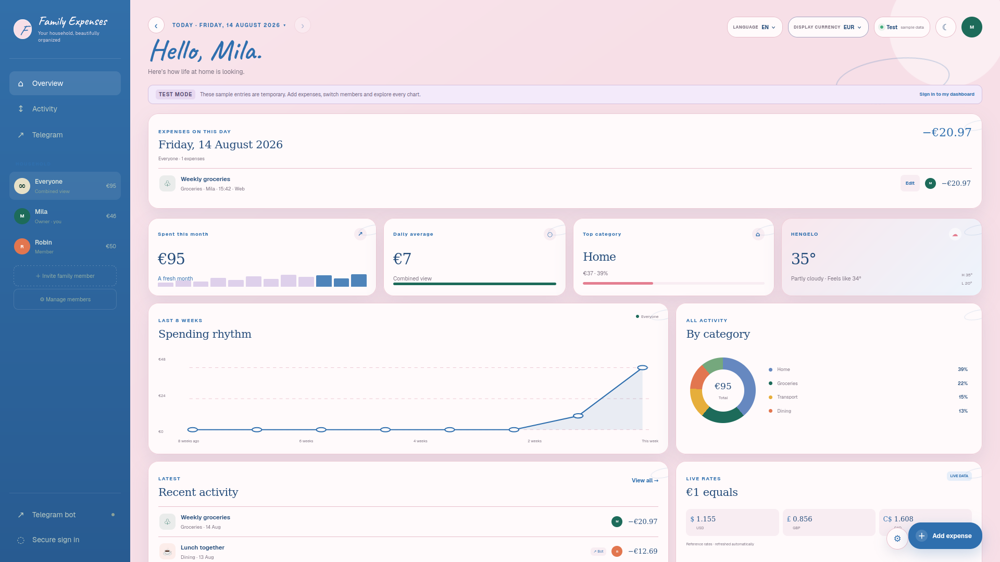
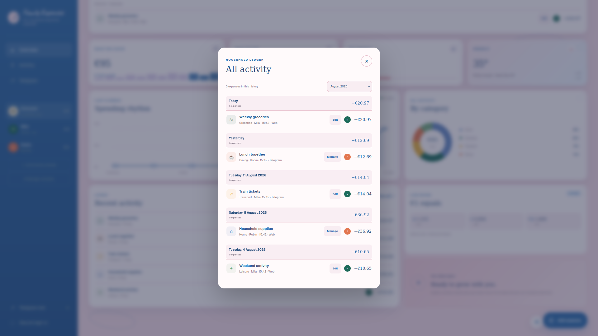
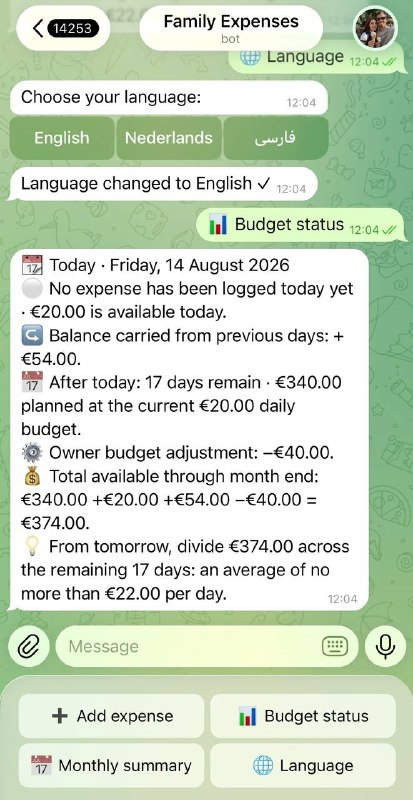

# Family Life Dashboard

**Phase 1 — a secure, multi-household expense and family-budget platform.**

Family Life Dashboard gives every household a private financial space without
removing individual accountability. Members record their own expenses from the
web dashboard or Telegram, while permissions determine whether they can see
only their own activity or the household's combined view.

Phase 1 is deployed on Cloudflare and includes persistent SQL storage,
role-based family management, configurable budgets, multi-currency support,
historical analytics, and a multilingual Telegram workflow.

## Public demo

[Open the randomized public demo](https://family-life-dashboard-demo.mhmd-zarabieh.workers.dev/)

The public demo uses temporary randomized sample data and has no connection to
the private household database. Signing in redirects users to the separately
protected dashboard.

## Screenshots

### Web dashboard



### Daily expense history



### Telegram bot



## Phase 1 highlights

- Separate private households with independent members, settings, and data
- Owner-managed invitations, removals, and household-view permissions
- Personal expense views plus an authorized `Everyone` view
- Responsive daily calendar and month-by-month expense history
- Web and Telegram expense capture with shared custom categories
- English and Dutch web interface; English, Dutch, and Persian Telegram bot
- Configurable household daily budget and base currency
- EUR, USD, CAD, and GBP base and display currencies
- Live exchange-rate conversion for alternative display currencies
- Effective-dated budget changes: past days retain their original budget
- Positive or negative daily carryover throughout each month
- Owner adjustments that remain separate from ordinary daily carryover
- Current-month guidance and historical month-over-month spending analytics
- CSV and JSON exports, audit logs, soft deletion, and versioned migrations
- Public randomized demo separated from authenticated household data

## Budget behaviour

The budget model is household-wide rather than per member. Every expense from
every active member contributes to the same daily and monthly position.

```text
Previous-days balance
+ amount remaining today
+ planned budget after today
+/- owner adjustment
= available amount through month end
```

Unused budget and overspending are carried forward only within the same month.
The carryover resets when a new month begins.

Daily-budget changes are effective from the date of the change. For example,
if an owner changes the budget from EUR 20 to EUR 18 today, previous days stay
calculated at EUR 20, while today, the remaining days, and future months use
EUR 18 until another change is made.

New households begin budget tracking on the day they are created. Their owner
selects the daily budget and base currency during initial setup.

## Currency model

Each household chooses a base currency: EUR, USD, CAD, or GBP. Budgets,
Telegram entries, carryover, and stored calculations use that base currency.

The display-currency selector converts the same values for viewing without
changing the household's accounting currency. If an owner changes the base
currency, existing monetary values are converted so they are not reinterpreted
as the same number in a different currency.

## Access model

- The first member of a new household becomes its owner.
- Only the owner can add or remove members and change family settings.
- New members initially see only their own expense details.
- The owner can grant a member access to the combined `Everyone` view.
- Members with combined access still cannot open another member's private view.
- The owner can review and remove any household expense.
- Telegram accounts are connected with expiring, single-use personal codes.

Authentication is enforced with Cloudflare Access. Server routes validate the
Access identity and apply household-scoped authorization before reading or
changing data.

## Technology

- TypeScript and React
- Next.js-compatible Vinext runtime
- Cloudflare Workers
- Cloudflare D1
- Drizzle ORM and versioned SQL migrations
- Cloudflare Access JWT validation
- Telegram Bot API
- Public weather and exchange-rate APIs

## Architecture

```text
Authenticated browser / PWA
            |
            v
   Dashboard Worker API -------- Weather and exchange-rate APIs
            |
            v
       Cloudflare D1
            ^
            |
     Telegram Worker <---------- Telegram Bot API

Public browser ----------> Isolated randomized Demo Worker
```

The Telegram webhook runs through a separate Worker so the main application
can remain protected by Cloudflare Access. Telegram requests are independently
validated using Telegram's secret-token header.

## Local development

Requirements: Node.js 22+, npm, and a Cloudflare account for D1-backed flows.

```bash
npm install
cp .dev.vars.example .dev.vars
npm run dev
```

Secrets belong only in `.dev.vars`, environment variables, or Cloudflare
Secrets. Never commit real credentials.

## Database setup

Create the D1 database and place the returned database ID in `wrangler.jsonc`:

```bash
npx wrangler d1 create family-life-dashboard
npm run db:migrate
```

Migrations preserve previous budget rules and monthly adjustments, allowing
historical reports to use the settings that were active at the time.

## Deploy the dashboard

```bash
npm run build
npx tsc --noEmit
npm run deploy
```

Configure Cloudflare Access for the private dashboard and store `POLICY_AUD`
and `TEAM_DOMAIN` as Worker secrets.

## Deploy the Telegram Worker

Store the Telegram credentials on the dedicated Worker configuration:

```bash
npx wrangler secret put TELEGRAM_BOT_TOKEN --config wrangler.telegram.jsonc
npx wrangler secret put TELEGRAM_WEBHOOK_SECRET --config wrangler.telegram.jsonc
npx wrangler deploy --config wrangler.telegram.jsonc
```

Tokens and secret values are never included in this repository.

## Quality checks

```bash
npm run build
npx tsc --noEmit
npm run lint
```

## Data and privacy

- Every operational query is scoped to a household.
- Member-level visibility is enforced by server-side authorization.
- Real credentials and local environment files are ignored by Git.
- Telegram tokens and linking codes are excluded from exports.
- Deleted expenses remain soft-deleted for auditability but are excluded from
  dashboards and exports.
- JSON and CSV exports provide portable, user-controlled backups.

See [SECURITY.md](SECURITY.md) for the security model and reporting process.

## Phase 2 roadmap

- Recurring expenses and bills
- Category-specific budgets and alerts
- Shared household calendar and tasks
- Receipt and voice-assisted expense capture
- Scheduled summaries and proactive notifications
- Expanded backup and recovery controls

## License

MIT
